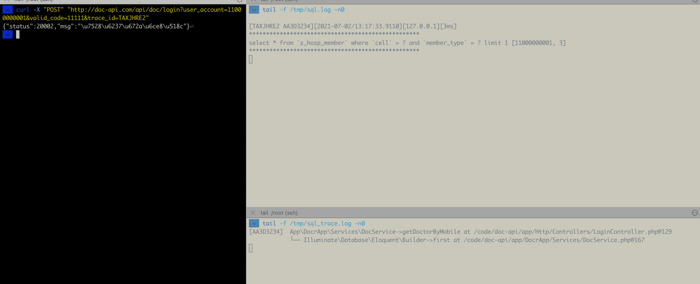

# 介绍

大量依赖数据库的业务，可以通过记录生命周期内所有 SQL 及其 SQL 执行位置，来调试代码。

## 版本要求 

版本 >= 6

PHP version >= 7.2


## 安装

```
composer require varobj/laravel-sqltrace
```

## 使用

编辑项目的文件 `app/Providers/EventServiceProvider.php`

`$listen` 数组中添加下面一行

```
QueryExecuted::class => [ \LaravelSQLTrace\SQLTraceEventListener::class, ]
```


## 效果




## SQL 日志

```
tail -f /tmp/sql.log
```

## SQL Trace 日志

```
tail -f /tmp/sql_trace.log
```


## 快速查询某条 SQL 的 trace

```
grep traceid -A 10 /tmp/sql_trace.log
```


## TODO

[ ] 推送指标到第三方接口

[ ] 完善判断逻辑: 记录日志 or 计数 
